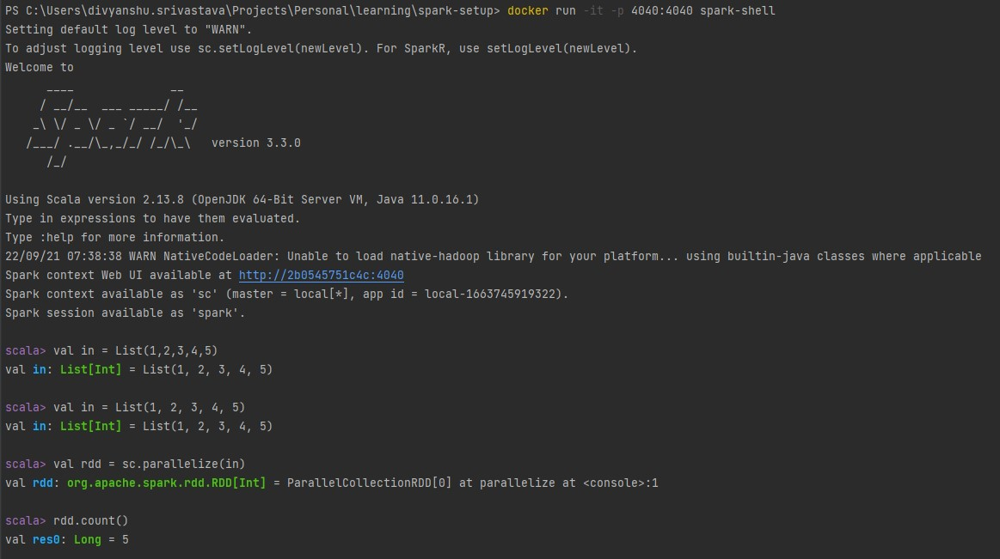
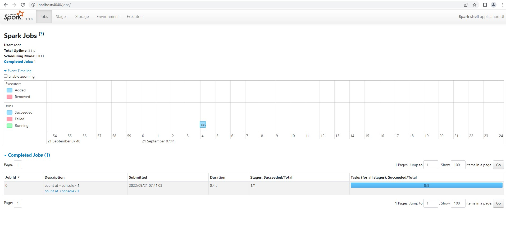

# Spark Standalone Cluster Sample

This repository includes a **POC** for creating a local spark cluster using docker containers, as well as examples in **Scala** and **Python** for connecting to a spark cluster and executing tasks.

## Requirements

|  | Version | Comment |
|--|--|--|
| **JVM** | 11 | To run Scala samples |
| **SBT** | 1.7.1 | To run Scala samples |
| **Scala** | 2.13.9 | To run Scala samples |
| **Python** | 3.10.7 | To run Python samples |
| **Docker** | 20.10.14 | - |
| **Docker Compose** | 2.10.2 | - |

It is entirely optional to download and install spark locally; you can simply build the image from a [Dockerfile](spark-setup/Dockerfile) and launch the spark shell by running the docker run command.

## Configuration

The following versions are used in the docker file:

|  | Version |
|--|--|
| **Linux** | alpine-3.16 |
| **JVM** | amazon-corretto-11 |
| **Python** | 3.10.7 |
| **Spark** | 3.3.0 |

Inside the docker file, the spark version **[spark-3.3.0-bin-hadoop3-scala2.13](https://www.apache.org/dyn/closer.lua/spark/spark-3.3.0/spark-3.3.0-bin-hadoop3-scala2.13.tgz)** is used.

## How to run?

 - Running single spark shell

       cd spark-setup
       docker build -t spark-shell .
       docker run -it -p 8080:8080 spark-shell
   

