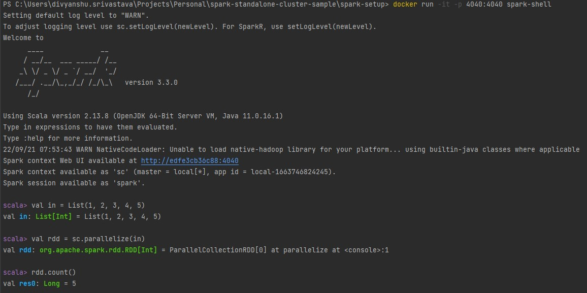
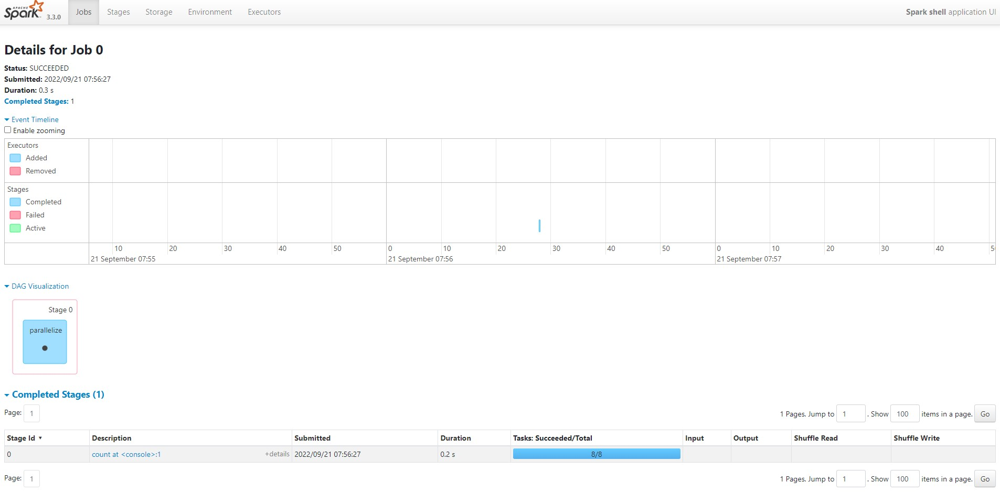

# Spark Standalone Cluster Inside Docker Container

This repository includes a **POC** for creating a local spark cluster using docker containers, as well as examples in **Scala** and **Python** for connecting to a spark cluster and executing tasks.

## Configuration

The following versions are used in the docker file:

|  | Version |
|--|--|
| **Linux** | alpine-3.16 |
| **JVM** | amazon-corretto-11 |
| **Python** | 3.10.7 |
| **Spark** | 3.3.0 |

Inside the docker file, the spark version **[spark-3.3.0-bin-hadoop3-scala2.13](https://www.apache.org/dyn/closer.lua/spark/spark-3.3.0/spark-3.3.0-bin-hadoop3-scala2.13.tgz)** is used.

## How to run?

 - Running Single Spark Shell
 - Running Standalone Cluster With 1 Master Node & 3 Worker Nodes
 - Running Scala Samples
 - Running Python Samples

### Running Single Spark Shell

    cd spark-setup
    docker build -t spark-shell .
    docker run -it -p 4040:4040 spark-shell

#### Output
   

Navigate to **localhost:4040** in the host machine's browser.

### Running Standalone Cluster With **1 Master Node** & **3 Worker Nodes**

    cd spark-setup
    docker-compose up

#### Output

Navigate to **localhost:8080** in the host machine's browser.

The above screenshot shows that the spark cluster is operational, with one master node and three worker nodes, and the master url is **spark://localhost:7077**.

### Running Scala Samples

**Note:** Please start the cluster as described in **Running Standalone Cluster With 1 Master Node & 3 Worker Nodes** before running the scala samples.

To run the Scala sample, the host machine must be configured as follows:

|  | Version |
|--|--|
| **JVM** | 11 |
| **SBT** | 1.7.1 |

**Note:** Scala version 2.13.8 is used in this project.

    cd scala-examples
    sbt clean compile "runMain CuriosityWeb.FirstRun"

#### Output

### Running Python Samples

**Note:** Please start the cluster as described in **Running Standalone Cluster With 1 Master Node & 3 Worker Nodes** before running the python samples.

To run the Python sample, the host machine must be configured as follows:

|  | Version |
|--|--|
| **Python** | 3.10.7 |

**Note:** The commands below are for Windows; for other operating systems, try finding the equivalent commands.

    cd python-examples
    virtualenv venv
    .\venv\Scripts\activate
    pip install -r requirements.txt
    python .\CuriosityWeb\first_run.py

#### Output

